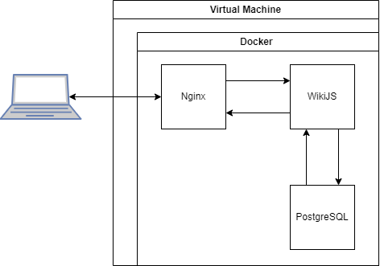

Wiki NodeJS App Prototype
=========
[WikiJS](https://github.com/requarks/wiki) is a modern, lightweight and powerful wiki app built on NodeJS. This repository contains tools to deploy a simple dockerized prototype of this application with PostgreSQL database container and Nginx container as a reverse proxy. 

Getting started
---------------
Download and install [VirtualBox](https://www.virtualbox.org/wiki/Downloads) and [Vagrant](https://developer.hashicorp.com/vagrant/downloads).

Add a password into ```./secrets/db_pass.txt``` and run in this directory:
```
vagrant up
```
Follow the provisioning steps. Vagrant will pull image of Ubuntu 22.04.2 LTS (Jammy Jellyfish) and setup virtual machine. Then it will install Ansible and run ```./ansible/playbook.yml``` inside that will install docker and run docker compose to deploy the application.

The app will be running at [http://localhost:80](http://localhost:80)

Architecture
-----



* A WikiJS container
* A PostgreSQL container
* An Nginx container


